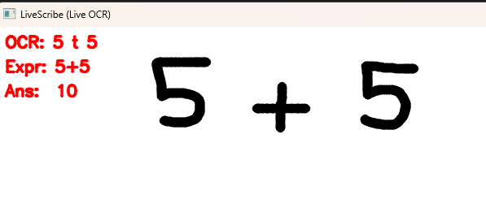
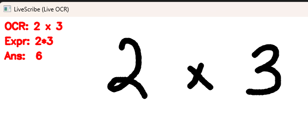

# LiveScribe




LiveScribe is an experimental computer vision project for recognizing handwritten math expressions from a drawing canvas and evaluating them.

I built this to explore how far I could get with symbol recognition, preprocessing, and expression parsing using deep learning, while keeping everything interactive and visual.

The project uses a **pretrained transformer-based handwriting model** for character-level recognition, combined with custom OpenCV preprocessing to clean and normalize user drawings before inference.

## What works so far
- Drawing-based handwritten input
- Image preprocessing (thresholding, resizing, normalization)
- GPU-accelerated inference with PyTorch
- Model configs and tokenizer included (weights excluded)

## Tech
Python · PyTorch · OpenCV · NumPy · Gradio

## Setup
```bash
pip install -r requirements.txt
